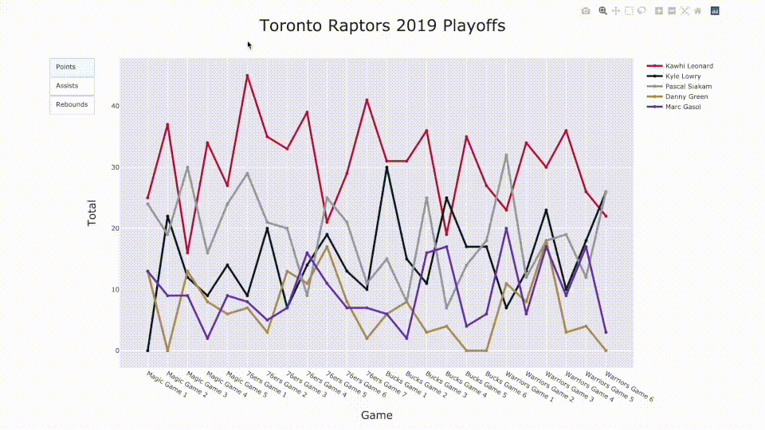

# Ball Plot
An interactive plot of points, assists, and rebounds of the Toronto Raptors
starters in the 2019 Playoffs.

## Installation
This project uses Python 3 and Plotly.

## Usage
* Move the cursor on the graph to see exact totals
* Click on the left column to view different statistics
* Double click on the right column to view specific players

## Credits
Data retrieved from [Basketball Reference](https://www.basketball-reference.com/)

## License
[MIT](LICENSE)
